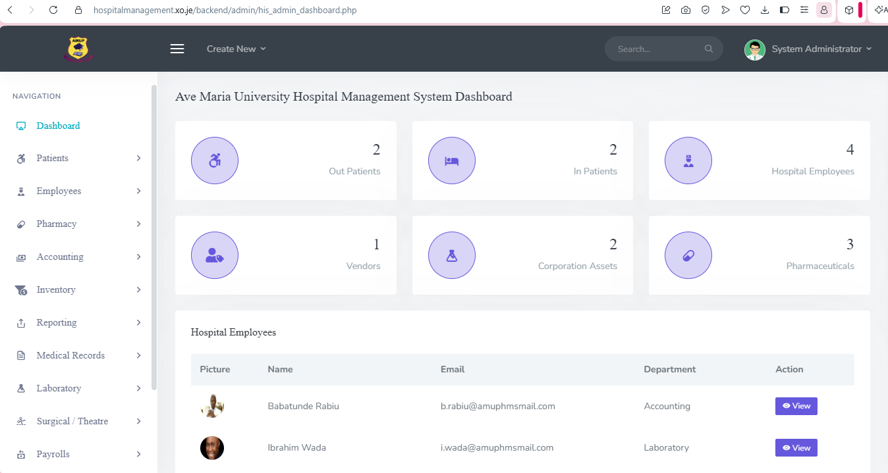

# Hospital Management System (HMIS)

A comprehensive PHP-based Hospital Management Information System supporting two roles: Admin and Doctor, covering the full operational workflow of a hospital.

## Live Demo
hospitalmanagement.xo.je

## Features

### Admin Portal
- Patient registration, records, and discharge management
- Patient transfers between hospitals/departments
- Employee management: add, assign to department, transfer, view records
- Payroll generation for individual or all employees
- Medical records management
- Prescription management
- Lab test requests and results
- Pharmaceutical inventory and categories
- Equipment inventory tracking
- Vendor management
- Accounting: payable and receivable accounts
- Surgery and theatre patient records
- Vitals recording (temperature, heart rate, blood pressure, respiration rate)
- Password reset management

### Doctor Portal
- View and manage assigned patients
- Add and update prescriptions
- Record and view lab tests and results
- Record patient vitals
- View payroll history
- Pharmaceutical inventory access
- Patient discharge and transfer

## Tech Stack
- Backend: PHP, MySQLi
- Database: MySQL
- Frontend: HTML, CSS, JavaScript, Bootstrap

## Security Notes
- Database credentials are excluded from version control via .gitignore
- Login authentication required for both Admin and Doctor portals

## Screenshots

Login Page

Admin Dashboard

## Setup Locally
1. Clone this repo
2. Import hmisphp.sql into your MySQL server (via phpMyAdmin or CLI)
3. Create a backend/admin/assets/inc/config.php and backend/doc/assets/inc/config.php file with your own database credentials:
   <?php
   $dbuser="root";
   $dbpass="";
   $host="localhost";
   $db="hmisphp";
   $mysqli=new mysqli($host,$dbuser, $dbpass, $db);
   ?>
4. Place the project folder in your XAMPP htdocs directory
5. Start Apache and MySQL via XAMPP, then access via localhost

## Author
Built by Paschal (Lupin Tech)
